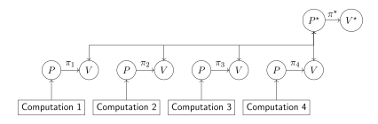

# Introduction

It is well-known that Ethereum has a scalability issue (the blockchain trilemma), which turns out to be a major bottleneck when the network needs to process thousands of transactions per second, e.g. Decentralized Finance (DeFi). One possible solution is to delegate complex computations to an off-chain solution, called Layer 2 (L2).

Amongst many possible ways to implement an L2 solution, Metis adopted the rollup paradigm: it processes a batch of transactions at a time and later posts the process results to layer 1 (L1), where a smart contract verifies and approves these operations.

Currently, one of the most common frameworks to design a rollup is the optimistic approach. In an optimistic rollup, a batch of transactions is received and, unless any of them is contested and proven invalid by vigilant third parties, the transactions are considered valid after some period of time (typically 7-14 days).

A more recent rollup framework, zero-knowledge (ZK) rollups, submits transactions for approval using state of art Zero-Knowledge protocols. This approach results in a much faster approval cycle with very strong security guarantees, but it adds significant complexity to controlling proof size, prover, and verifier times. Nevertheless, Metis believes in the potential of this methodology, and it is committed to investing time, effort, and resources to pursue and implement these ideas.

In this document, we describe the state of the art in the L2 space and present, from a ZK engineering point of view, various technical challenges ranging from suggested optimizations for dramatic performance improvements, to theoretical ideas for new cryptographic protocols.

# Background

## Preliminary notions

For clarity and to avoid potential ambiguities, we informally define the following notions as used in this paper.

### MIPS

MIPS stands for *Microprocessor without Interlocked Pipelined Stages*, a decades-old and stable processor architecture. Several MIPS instruction sets have been standardized; for concreteness, we refer to the instruction set specified in [this link](https://inst.eecs.berkeley.edu/~cs61c/resources/MIPS_help.html).

### Layer 1

Layer 1 (L1) refers to the Ethereum Mainnet, which is the blockchain that Metis uses as its consensus-achieving mechanism.

### Layer 2

Layer 2 (L2) is a separate blockchain administered by an independent entity (possibly in a distributed manner). This L2 blockchain communicates periodically with L1, stores information (such as transaction data) on L1, and sends additional evidence (such as ZK proofs) in order to prove to L1 that the transactions are processed correctly. At L1, these functionalities are implemented through smart contracts.

The purpose of this architecture is to gain efficiency and transaction throughput and reduce gas costs while taking advantage of the property of L1 as a distributed, irrefutable ledger. Metis also administers an L2 blockchain, called Andromeda.

### Layer 3

The term Layer 3 refers to any program running over L2 data, or to independent programs that help maintain L2 functioning properly. The main reason to add an L3 over an L2 blockchain is to improve performance, moving some computations to an independent system with fewer blockchain limitations. Eventually, since L3 uses a different trust model than L2, the computations it performs should be verified by L1/L2 in the same way L2 computations are verified by L1.

### ZK Proofs of Verifiable Computation

In this document, Zero Knowledge Proofs are used to implement Verifiable Computation between a prover and a verifier. The prover performs some (possibly lengthy) computation that validates some results published on the blockchain (L1 or L2) and produces additional information to assist the verifier in the audit of these results, i.e. establishing its correctness. Subsequently, the verifier generates a random string and performs checks which allow him to convince himself that the result published is indeed correct.

### Optimistic rollups

An optimistic rollups considers transactions correct until proven otherwise. In this scenario, the otherwise proof is an investigation process triggered when users claim there is fraud in the transaction. We call this claim a *challenge* and the users who can trigger it the *challengers*. If a transaction is not challenged, then it is considered correct at the end of the challenge period (typically a few days).

### ZK rollups

A Zero-Knowledge (ZK) rollup uses Zero Knowledge Proof techniques to create proof of validity for transactions. The use of *ZK proofs* can reduce withdrawal time (the time that the network/L1 needs to finalize a transaction) from days to hours and allow the validity of the transactions submitted to L2 to be proved without revealing additional, potentially sensitive information. This is achieved by having L2 provide cryptographic validity proof before updating the blockchain state of L1. The verification process in a ZK rollup is more secure and faster than in optimistic rollups. However, it is more difficult to implement.

### Comparing the Optimistic and ZK rollups

There exist two types of time measurements to compare the rollup paradigms:

-    **Confirmation time: ** This is the time it takes for the front-end, which is a decentralized application (dApp), to interact with L2 and L1, and to register transactions correctly.

-    **Finalization time: ** This is the time it takes for the back-end (the L1 or L2 blockchain, depending on the context) responsible for registering the finality (correctness) of the transaction.

In comparison to ZK rollups, optimistic rollups take less confirmation time to consider transactions as valid (it happens as soon as the sequencer submits transaction data to L1). However, they take more finalization time to consider transactions as faulty (it happens only after the challenge process has been triggered and concluded), whereas ZK rollups only need to wait for a prover to generate proof and a verifier to reject it.

See [this link](https://vitalik.ca/general/2021/01/05/rollup.html) for a detailed comparison between the two.

## zkSNARKs and zkSTARKs

Even though many Zero-Knowledge protocols for proving the validity of specific statements have been developed over the last 40 years of research, only recently we have seen efficient protocols for generic computations, such as Zero-Knowledge Succinct Non-Interactive Argument of Knowledge (zkSNARK) and Zero-Knowledge Scalable Transparent Argument of Knowledge (zkSTARK). ZK rollups can be implemented using any of these ZK techniques and, in both cases, proofs can be generated off-chain and posted on-chain so anyone can verify them.

zkSNARKs were implemented for the first time by the ZCash team. Although its proofs are small and no security issues have been identified in this technique so far, it requires a trusted setup ceremony before running the protocol, and, due to its underlying cryptographic assumptions, it is not quantum-safe. zkSTARKs were first implemented by the StarkWare team. Its proof sizes are not small compared to proof sizes from SNARKs, but they can be generated and verified faster, and also they are immune to quantum attacks.

In addition, for our purposes, the salient feature of the original STARK paper is the possibility of modeling a computation as a processor with a finite instruction set, as we explain below.

## FRI

Techniques such as SNARKs and STARKs transform a computation to some specific polynomial which must be of a low degree. The Fast Reed-Solomon Interactive Oracle Proof (FRI) is a protocol that shows a polynomial is close to another polynomial of low degree, and it is applied to STARK polynomials in the verification of their low degrees.

# Current software architecture

Our proposed architecture, zkMIPS (see next section), is inspired on the Cannon project by the Optimism team, which implements a method for investigating a disputed transaction between the Sequencer and the L1 rollup Validator. This investigation process is executed during a period called the *dispute period*, and includes verifying L2 Merkle roots generated by Sequencer and L2 rollup Validator.

Cannon also implements a MIPS interpreter on L1 in the form of a smart contract with about 400 lines of code. This interpreter receives two different sets of EVM opcodes from the L2 rollup Validator, the Sequencer, and converts both into MIPS opcodes. In addition, it converts data stored in Ethereum memory into MIPS data memory. In the last step, the MIPS interpreter sends both sets of opcodes and data to the Shell Executor.

Cannon uses a minimally modified subset of *go-ethereum* (Geth) compiled to MIPS called Minigeth, in which the consensus protocol, the RPC, and the database have been replaced by a Pre-image Oracle. On L2, there are four software components: Minigeth, a Pre-image Oracle, a Sequencer, and an L2 rollup Validator.

<figure align="center">
<figcaption aria-hidden="true">Figure 1: The interaction of L1 blockchain and L2 Rollup with Cannon. </figcaption>
</figure>

Figure 1 illustrates how L2 components communicate between themselves and with L1:

1.  Sequencer submits transactions and generated commitments for a specific block.

2.  L2 Validator fetches the submitted commitments.

3.  Validator creates a new set of commitments and verifies the fetched commitments match the generated ones. Note that during this process both commitments are submitted to MiniGeth.

4.  MiniGeth checks whether MIPS Memory has instructions related to that block.

5.  If MiniGeth does not find them in MIPS Memory, then it uses Pre-image Oracle. Pre-image Oracle accepts a block or transaction hash from MiniGeth.

6.  Pre-image Oracle fetches the pre-image of that block or transaction from the EVM state.

7.  Pre-image Oracle passes the result to MIPS Interpreter.

8.  MIPS Interpreter converts the EVM opcodes to MIPS opcodes and stores them in MIPS Memory.

9.  Validator sends the result of its decision to Challenger.

10. If L1 Validator does not agree with the process result, Challenger Smart Contract repeats the verification by submitting the two commitments to Canon.

Shell Executor on L1 receives MIPS opcodes and data from L2 to find out whether there is any disagreement between the two instruction sets. In case of a disagreement between the rollup Validator and L2 Sequencer, it returns the line number of the EVM instruction in which the disagreement has happened and declares the Merkle root (which is submitted by Sequencer) as invalid. For getting more information on a particular block (e.g., access to an EVM state to obtain the block header), Shell Executor calls Pre-Image Oracle, which receives the hash of a block and returns the block header. Hence, Shell Executor can traverse the previous block until finding the block which contains the disputed instruction. Thus, Pre-Image Oracle replaces the usage of the database for this on-chain interpreter, eliminating the necessity to maintain a database in Cannon’s VM (MiniGeth).

# Challenges

In L2 solutions, there is some underlying computation *C* that needs to be verified by L1 before inserting L2’s processing results back into L1. To do this, *C* needs to be transformed into an equivalent polynomial for STARK. We distinguish between two important possible representations of *C*.

-    **Boolean and algebraic circuits: ** A computation *C* can always be represented as an algebraic circuit, which in turn can be converted to a Boolean circuit. Several methods have been developed to create a STARK proof from one of these two representations, even though creating a circuit can be a time-consuming task. See [this link](https://vitalik.ca/general/2016/12/10/qap.html) for an example.

-    **Finite instruction set: ** Imagine you have a processor which is able to execute a finite set of instructions and a program that reflects the computation *C* in this instruction set. Note that each program instruction will change the processor’s overall state from some well-defined current state to the next. This sequence of states is called the (execution) trace, and it can be used in STARKs to help prove there is a valid sequence of states for *C*.

Important questions concerning the second representation are: what exactly should be the specifications of a processor to emulate this instruction set? How many registers does it have? Which instructions are allowed? Etc. There are many choices possible, which strongly depend on the context where the ZK Proof has to run, among other factors.

StarkWare chose to define a new language called CAIRO, which stays close to their Algebraic Intermediate Representation (AIR). This leads to efficient protocols but requires programmers to adjust to this language. Instead, we propose a different approach, using an already established language, as we explain in the next section.

## Challenge: Applying MIPS

**Problem. ** As already explained, in an optimistic rollup, a challenger contests a proof by demonstrating an error in the execution of the program that executes a transaction, whereas in a ZK rollup, a prover receives as input a program that executes a transaction and uses the program’s logic to generate a zkSTARK/zkSNARK proof for its correctness.

We expect that both approaches can coexist and be unified, a concept we call a hybrid rollup. It seems natural to use the *same* programming language as input for both types of rollups. But then, the question is which programming language is more appropriate.

**Solution. ** Since we need to verify the source code that validates Ethereum (Layer 1) transactions, the EVM instruction set seems to be the logical choice. However, the complexity of interpreting EVM code requires a lot of work to write a prover that compiles its logic to ZK proofs. It only gets worse if we consider the frequent updates in the set of [EVM opcodes](https://kelvinfichter.com/pages/thoughts/hybrid-rollups).

Therefore, we intend to use the MIPS instruction set due to its well-known stability (it has not changed since the 90s) and its simple opcodes. This choice will also allow us to take advantage of incorporating Cannon into our system, which implements a method to challenge a transaction using a subset of MIPS. A complementary approach is provided by the [Zilch project](https://eprint.iacr.org/2020/1155.pdf), which constructs ZK proofs for a very limited set of MIPS instructions.

An additional advantage of developing ZK circuits based on MIPS programs is that we don’t have to worry about the EVM-based ZK types like [ZK Type 1, 2, 3, or 4](https://vitalik.ca/general/2022/08/04/zkevm.html). This way, we obtain much more flexibility in developing ZK circuits and implementing formal or push-button verifications to make our circuits bug-free and safe from all types of attacks.

**Challenge 1. ** *Use the MIPS instruction set as the programming language for ZK rollups and apply it to the ZK-proof system design.*

## Challenge: Fractal scaling

**Problem. ** A naive implementation of the functionalities described in the previous section would lower TPS, so these components could be partially implemented outside Layer 2 without reducing the system’s reliability. Adding a Layer 3 solution to the architecture improves scalability, but this should not reduce decentralization and security.

**Solution. ** One possible approach to solve this issue is to implement an application-specific Layer 3 built over Layer 2 by following a recursive proof generation method, known as Fractal Scaling. This helps to balance security, scalability, and decentralization since the proof generation process is done on machines to which attackers do not have access, whereas integrity is preserved because all off-chain computations can still be verified on-chain.

More specifically, zkSTARK proofs can be created in Layer 3 to help Layer 1 verify whether Ethereum state roots were correctly computed from the execution of a batch of transactions in Layer 2. These proofs can be sent to Layer 1 through call data at a lower cost since it could contain one proof for thousands of transactions united in one batch. Hence it is expected that Fractal Scaling will save gas and improve the TPS of the system.

In the zkMIPS solution, the Sequencer on L2 generates multiple batches in which each batch has a hash value pointing to the next batch. On L3, there are several provers that process the received batches in parallel and generate one STARK-based proof for each transaction inside a batch. Then, by applying SNARK-based proof recursion and aggregation techniques, the prover combines the generated STARK-based proofs and will create one proof per batch. Finally, again all the SNARK-based proofs for batches will be combined using a recursive proof technique and will be returned to L1’s verifier smart contract.

**Challenge 2. ** *Although the required architecture with the capability of running smart contracts on L2 and bridging contracts on L1 is available, still high cost of the on-chain storage on L1, as well as the off-chain storage on L3, are challenges that should be investigated.*

## Challenge: Provider unavailability

**Problem. ** In the case of unexpected shutting down or crashing of the proof generation process, new provers or Sequencers are unable to continue the process as they cannot track the previous prover’s pending work. Therefore, new provers will lose the state of processing accomplished by the previous prover who got crashed. If we lose this information then a new prover or Sequencer needs to start the process from the beginning, therefore increasing the time and cost spent for the total proof generation process and inflating the processing transaction fee.

**Solution. ** One possible solution is to periodically create checkpoints for transaction summaries and other details necessary to rebuild a current state by some other prover, using Layer 3 offline storage. This storage keeps the checkpoint until a generated proof is submitted by a prover and reduces costs as it is not required to post transaction state details to L1.

In case of unexpected crashing scenarios, whenever a new rollup provider gets back online it can fetch the checkpoint from storage and continue the proof generation process.

**Challenge 3. ** *Designing a system to store the checkpoints during the ZK process is challenging. Also, finding the optimal value for the time interval to update the checkpoints should be investigated.*

## Challenge: Polynomial commitment schemes and proof size

For efficiency reasons, almost all zkSNARK and zkSTARK protocols rely heavily on some commitment scheme for the polynomials involved. A natural way to classify these schemes is according to their underlying cryptographic assumption:

1.  Hash-based, e.g. using Merkle trees (as in FRI)

2.  Discrete Log-based, e.g. over elliptic curves (as in BulletProof)

3.  Pairing-based, i.e. using pairings as well as elliptic curve discrete log (as in KZG)

4.  Hidden-order based, i.e. using a group whose order is known to nobody (such as in RSA and class groups)

These commitment schemes can be compared according to different criteria, e.g. proof size, prover time, verifier time, setup assumption, post-quantum resilience, etc. See [this link](https://docs.google.com/presentation/d/1YJX_MgWjhsFHiubHoCMb5F27rtN9AcxgaKMswGFf8I4) for an overview.

We intend to study which commitment scheme will be most suitable for our context, in which proof size concerns us the most. More precisely, KZG or Bulletproof (BP) could be used as zkSTARK’s polynomial commitment scheme instead of Merkle trees. We emphasize that this approach could, in theory, reduce the complexity of crucial parts of proof size from *O*(log2(*d*)) to *O*(log(*d*)) or *O*(1) (to BP and KZG-based zkSTARKs), and parts of prover time from *O*(log2(*d*)) to *O*(*d*) or *O*(1) (idem), where *d* represents the degree of modeled polynomials.

However, the feasibility of changing a polynomial commitment scheme has to be properly analyzed, so we cannot guarantee these performance improvements as real complexity depends on variables that are not yet considered here.

The benchmarks for our preliminary zkMIPS implementation using [libSTARK](https://github.com/elibensasson/libSTARK) are presented in Figure 2. The results were generated for different values of the blow-up factor *β*, a STARK approach variable typically defined as a power of 2. As the name suggests, the blow-up factor *blows* the evaluation domain over which FRI polynomials are evaluated. Therefore, for a higher *β*, the prover takes longer to generate the proofs, but soundness can be achieved more easily, causing proof size and verification to decrease. This relation can be observed in the benchmark results.

<figure align="center">
<figcaption aria-hidden="true">Figure 2: Benchmarks for preliminary zkMIPS implementation</figcaption>
</figure>

**Challenge 4. ** *Investigate how an appropriate choice of a polynomial commitment scheme will reduce the proof size and how to integrate the proposed protocol with other protocols in the applied ZK rollup scheme.*

## Challenge: Hybrid Rollups and various transaction types

**Problem. ** The high cost of ZK rollups discourages some users from requesting this type of service, while the high withdrawal time of optimistic rollups might be a bigger disadvantage to other users One possible approach to balance both confirmation and finalization times, as well as transaction cost, is to provide both optimistic and ZK rollup services at the same time to satisfy all types of users. The question that should be addressed is how to combine these rollups in one architecture.

**Solution. ** By applying the Bedrock architecture as implemented in the [Cannon project](https://github.com/ethereum-optimism/cannon/wiki/Cannon-High-Level-Overview) developed by the Optimism team, we can combine both optimistic and ZK rollups. Applying this architecture requires several design choices, such as transaction types and execution time parameters, in order to optimize the system’s confirmation and finalization times. The proposed hybrid solution will allow users to choose between optimistic and ZK rollup services seamlessly.

We envision a system with different *Transaction Categories*. Each category would have its own configurable mechanism to automatically decide whether its transactions should be validated via optimistic or ZK rollups if the user chooses to. Moreover, the soundness level (how hard it is to get a faulty transaction to be accepted as correct in ZK rollups), as well as the policy (such as defining the challenger’s reward in an optimistic rollup) would be configurable. As a result, each transaction category would have different latency, depending on the configuration.

In this setup, hybrid rollups face several challenges. For example, the validity of ZK rolled-up transactions depends on previously optimistic rolled-up transactions. Thus, how to properly implement this categorization is a question that still deserves considerable thought.

**Challenge 5. ** *How can optimistic and ZK rollups accomplish transaction approval in one unified architecture? Also, how to identify independent transaction batches that allow having a transactions batch finalized before the previous one?*

## Challenge: Alternative recursive ZK architectures

One way to overcome the issue of large ZK Proofs and prover times is to change how parties communicate in these protocols and what the communication between themselves represents. For instance, instead of verifying on-chain a proof (generated off-chain) for the validity of a transaction, one could design an additional ZK protocol to verify off-chain that same proof and use this off-chain verification to generate a second, smaller, proof to be verified on-chain.

The motivation behind this idea is that even though verifying a proof *π* for a computation *C* is faster than running *C*, sometimes it is not fast enough. Therefore, we could create a proof *π*⋆ for the correctness of *π* (the target computation is now the verification of *π* itself). For this reason, we use the adjective “Meta” to refer to this new proof, as well as to the prover *P*⋆ that generates it and verifier *V*⋆ that verifies it. This scheme is illustrated in Figure 3.

<figure align="center">
<figcaption aria-hidden="true">Figure 3: Meta ZK Proof</figcaption>
</figure>

Of course, *π*⋆ is intrinsically related to *π* and the validity of one of these proofs must imply the validity of the other by design. The difference between them, however, is the introduction of a new level of abstraction, where the validity of computation is replaced by the verification of this validity. On this new level, since proofs being verified are often produced by the same algorithm *P*, we can take advantage of their similarities to group many verifications into one meta-proof, achieving even better results. This optimized scheme is illustrated in Figure 4.

<figure align="center">
<figcaption aria-hidden="true">Figure 4: Meta ZK Proof for multiple ZK Proofs</figcaption>
</figure>

A similar idea has already been notably implemented by [Coda/Mina](https://minaprotocol.com/wp-content/uploads/technicalWhitepaper.pdf) and [Plonky2](https://github.com/mir-protocol/plonky2/blob/main/plonky2/plonky2.pdf). These projects use a framework known as Recursive ZK Proofs, which consists of grouping recursively many statements into one, and then proving only this final statement, as illustrated in Figure 5.

<figure align="center">
<figcaption aria-hidden="true">Figure 5: Recursive ZK Proof</figcaption>
</figure>

Even though Recursive and Meta ZK Proofs are similar in many aspects, we intend to employ Meta ZK Proofs because we believe there are many opportunities for optimization when verifying multiple ZK Proofs for different transactions at the same time. Furthermore, the generation of a ZK Proof reduces the full execution of computations to their verifications, which tends to be much faster and equally valid. Therefore Meta ZK Proofs can achieve the same soundness as the proofs they are reducing, but with significantly lower complexity.

**Challenge 6. ** *Explore alternative recursive ZK architectures.*

## Challenge: Security concerns

Formal Verification methods are mathematically precise techniques that analyze the specification, development, and verification of systems and protocols. Creating a formally verified implementation of a probabilistic proof system or protocol is challenging. However, the resulting guarantees avoid security vulnerabilities in the designed protocol/system.

In a future version of zkMIPS, we will apply Formal Verification methods to realize the following improvements and prevent attacks on the ZK scheme and verifiers:

-   To improve security, we intend to apply formal verification methods to the ZK proof generation protocol. We will experiment with both the State exploration and the Proof based approaches. State exploration can be useful for detecting common vulnerabilities such as reentrancy attacks, integer overflows, and unauthorized access. Proof-based can be useful for detecting subtle logic errors and security vulnerabilities that may be difficult to detect using state exploration, and also provide a high degree of confidence in the correctness and security of the contract. We use proof assistants such as Coq, Isabelle, and the K framework.

-   In addition, to find ZK program vulnerabilities, we are following the Formal Specifications method using the *Why3* platform which verifies programs developed in Rust.

-   To improve the security of written codes in Solidity, we will be using the Satisfiability Modulo Theories (SMT) Checker application and the Horn-solving technique, or similar tools and techniques if they become available.

-   To analyze the *gas* amount consumed by smart contracts, we will be using tools such as Oyente and Slither.

**Challenge 7. ** *Investigate the security of the designed protocol/system using formal verification methods. This investigation will analyze the provided solution from a technical perspective and assess its feasibility.*

## Challenge: Commitment schemes based on other assumptions

There exist little-known bit commitment schemes which use the Subset Sum problem as an underlying assumption and seem as efficient as Discrete Log schemes, but the known ones have similar construction and properties, allowing protocol designers to easily replace these schemes. The main advantage of applying a Subset Sum scheme to ZK protocols is that it makes them automatically quantum-resistant, with the addition of having similar Discrete Log schemes’ performance. However, this efficiency in terms of proof size, prover time, and verifier time needs thorough analysis (in particular, when applied to committing to polynomials).

**Challenge 8. ** *Investigate the applicability of commitment schemes based on Subset Sum in the context zkSNARKs/zkSTARKs.*

## Challenge: Implementation concerns

zkMIPS will accept as input MIPS assembly instructions from any type of application or system including IoT devices, L2 chains using Canon Optimism, and Cloud APIs. It will output ZK proofs that can be verified on the Ethereum L1 chain. Hence, zkMIPS can be used as a generic ZK Proof system in any centralized or decentralized application.

We have started implementing zkMIPS using the FRI protocol following an interactive model. Our current zkMIPS deployment accepts MIPS assembly instructions, parses them into stream format, and loads them into RAM Memory. The result is called a RAM Program, which is converted into Binary Algebraic Intermediate Representation (BAIR) constraints. The result is passed on to the FRI protocol which ensures the complexity of linear proof and the complexity of logarithmic verification (i.e., Low Degree Testing).

In our implementation we were faced with the following main issues:

-   The proof size is linear in the size of the computation trace, even after the reduction of witness size. This increases storage costs on the prover side.

-   The final verifier needs to interact with the prover continuously until the proof is generated. Hence, the verifier process had to be on an untrusted machine. This is again challenging because L1 cannot rely on an untrusted machine to update its state.

**Challenge 9. ** *zkMIPS uses existing software libraries written in several languages. Ensuring the development, integration, optimization, reliability, and security of the final product constitutes a challenging endeavor.*

# Collaboration

Metis invites bright industry experts, researchers, and leaders who are interested to collaborate on the zkMIPS project. This invitation is not limited to the research and implementations mentioned in this document; Metis embraces other innovative ideas to improve the proposed hybrid rollup solutions in this document.

